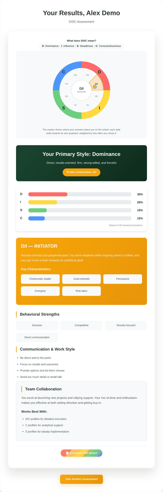
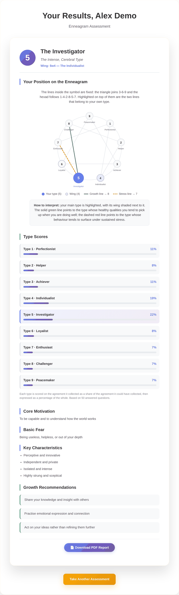
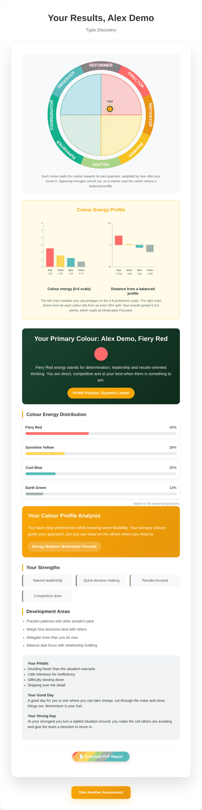

# Typix

Typix is a web application for taking and generating reports for three popular personality assessments: DISC, Enneagram, and Insights. The project is built with Vue 3 and Vite, providing a fast and modern development experience.

## Assessments Overview

### 1. DISC Assessment
- **Purpose:** Measures four personality traits: Dominance, Influence, Steadiness, and Conscientiousness.
- **How it works:** Users answer a series of questions. Their responses are scored to determine their DISC profile, which is then presented in a detailed report.



### 2. Enneagram Assessment
- **Purpose:** Identifies which of the nine Enneagram types best describes the user.
- **How it works:** Users complete a questionnaire. The system analyzes the answers to assign an Enneagram type and provides a personalized report.



### 3. Typix Discovery Assessment
- **Purpose:** Typix Discovery model, this assessment helps users understand their communication and working styles.
- **How it works:** Users respond to prompts, and the app generates an Insights profile and report.



## Project Structure
- `src/components/surveys/`: Survey components for each assessment.
- `src/components/reports/`: Report components for each assessment.
- `src/views/`: Main views, including the homepage, survey wizard, and report page.
- `src/composables/`: Reusable logic, such as PDF export and translations.
- `src/i18n/`: Internationalization support.

## 📚 Documentation

Comprehensive documentation is available in the `/docs` folder:

- **[Complete Documentation Index](docs/README.md)** - Start here for all documentation
- **[Use Case Diagrams](docs/diagrams/use-cases.md)** - Detailed use cases for all assessments
- **[4+1 Architectural Model](docs/architecture/4+1-model.md)** - Complete system architecture
- **[Business Design](docs/business/business-design.md)** - Business strategy and model
- **[Functional Design](docs/functional/functional-design.md)** - Detailed functional specifications

### Documentation Highlights

The documentation includes:
- ✅ **Use Case Diagrams**: Complete user flows for all three assessment types
- ✅ **4+1 Architectural Model**: 
  - Logical View (component structure)
  - Process View (runtime behavior)
  - Development View (code organization)
  - Physical View (deployment)
  - Scenarios (use cases)
- ✅ **Business Design**: Market analysis, value proposition, business model, roadmap
- ✅ **Functional Design**: System requirements, UI specs, performance, security, i18n

## Getting Started Locally

### Prerequisites
- [Node.js](https://nodejs.org/) (v16 or higher recommended)
- [npm](https://www.npmjs.com/) or [yarn](https://yarnpkg.com/)

### Installation
1. Clone the repository:
   ```sh
   git clone https://github.com/janvanwassenhove/typix.git
   cd typix
   ```
2. Install dependencies:
   ```sh
   npm install
   # or
   yarn install
   ```
3. Start the development server:
   ```sh
   npm run dev
   # or
   yarn dev
   ```
4. Open your browser and navigate to `http://localhost:5174` (or the port shown in your terminal).

## Accessing on GitHub

You can find the source code and contribute to Typix on GitHub:

[https://github.com/janvanwassenhove/typix](https://github.com/janvanwassenhove/typix)

## Live Demo

You can try Typix live at:  
[https://janvanwassenhove.github.io/Typix](https://janvanwassenhove.github.io/Typix)


