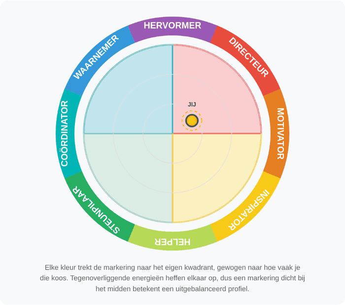
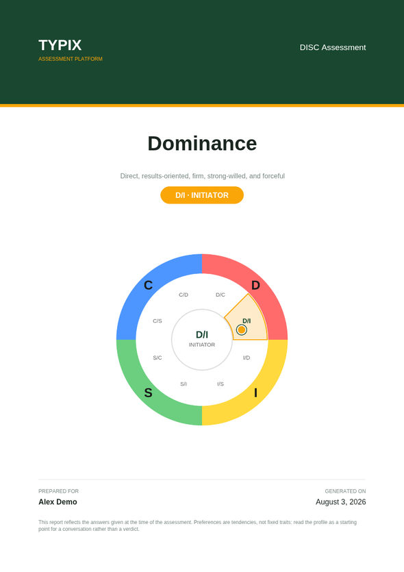
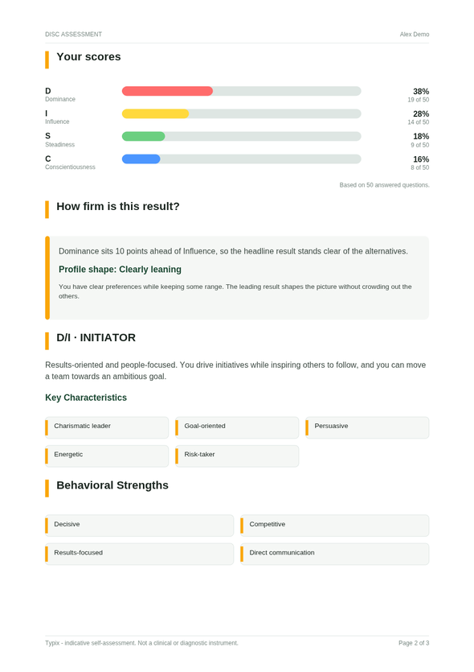
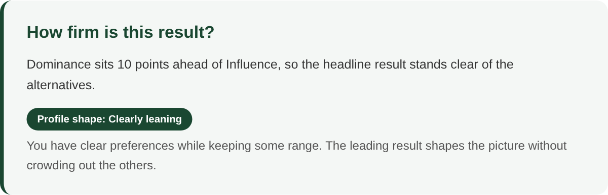
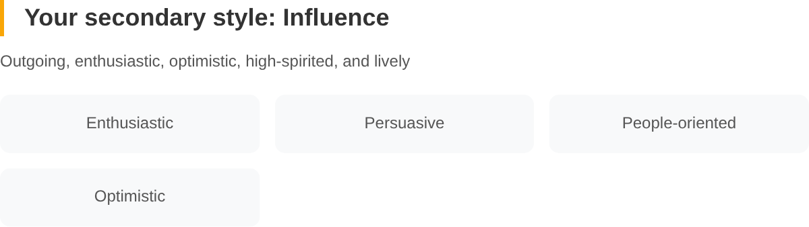
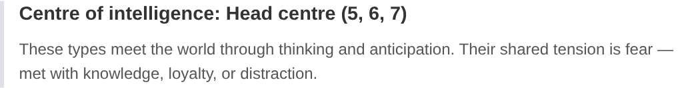
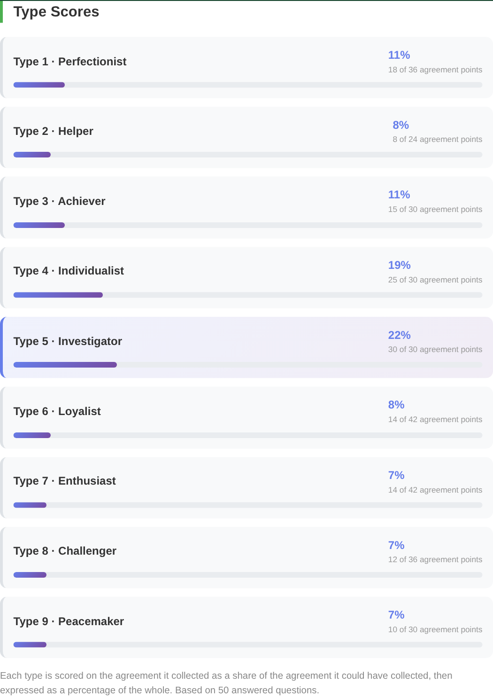

# Release notes

## Unreleased — Report accuracy audit

All three reports were audited end to end: how answers are stored, how they are turned into
scores, and whether the charts show what the numbers say. Several defects were found that
changed the result a user was shown. This release fixes them, moves scoring into a tested
module, and adds screenshots of each report below.

---

### DISC

The wheel now places each combination inside the correct quadrant, highlights the segment your
answers land in, and draws a marker derived from the actual score distribution.

**Fixed**

- **Eight of twelve profiles were missing.** `D/S`, `S/D`, `I/C` and `C/I` had no entry in the
  profile table and silently fell back to `D/I`. A steady, detail-driven respondent could be
  shown the headline "Your Primary Style: Steadiness" directly above a write-up describing a
  charismatic risk-taker. All twelve ordered pairs now have their own profile.
- **The wheel was drawn once, before the answers loaded.** The parent view reads answers from
  `localStorage` in its own `onMounted`, which runs *after* the child's. The canvas was painted
  from an empty result set, so the highlight sat on `D/I` for every user regardless of their
  scores. The wheel now redraws whenever the results change.
- **Half the wheel labels were in the wrong quadrant.** `I/D` sat in the D quadrant, `S/I` in
  the I quadrant, and so on. Each quadrant is now split between its two neighbours, so `D/I`
  sits next to `I/D`.
- **An unanswered report rendered `NaN%`** on every bar and still claimed a primary style.
  There is now an empty state.
- **Percentages did not always sum to 100** because each bar was rounded independently.
- **Ties were broken inconsistently**, so the headline style and the combination badge could
  disagree.
- **Scoring assumed option order.** Every question's options had to be listed in D, I, S, C
  order or the answer counted towards the wrong style. Each option now carries its style
  explicitly, in all five languages.

### Enneagram

**Fixed**

- **The scoring ignored the questions.** Types were assigned with
  `(answerIndex % 9) + 1` — the *agreement level* picked the type, not the statement being
  agreed with. Answering "Completely agree" to all fifty questions returned Type 7 at 100%;
  answering "Neutral" to all fifty returned Type 4. Types 8 and 9 were unreachable, because the
  agreement scale only has seven points. Every question is now tagged with the type it measures
  and scored on the 0–6 agreement scale.
- **Scores are normalised per type.** Types are covered by different numbers of questions
  (4 to 7), so a type's score is the agreement it collected as a share of the agreement it
  could have collected, before being expressed as a percentage.
- **The symbol was rotated 80° out of position**, putting Type 9 on the left instead of the top.
- **The interior lines connected the wrong types.** The label said "triangle (3-6-9) and hexagon
  (1-4-2-8-5-7)"; the code drew 2-5-8 and 9-3-1-7-4-6.
- **The lines were rotated independently of the numbers**, so for any dominant type other than 1
  they floated free of the circles they were supposed to join.
- Added the wing, and the growth (integration) and stress (disintegration) lines for the
  dominant type, with a legend.

### Typix Discovery (Insights)

**Fixed**

- **The wheel marker was 45° out.** Each colour was aimed at the *edge* of its quadrant rather
  than its centre, so a Red-dominant profile plotted on the Red/Yellow boundary.
- **The marker barely left the centre.** The vector sum was never normalised, so a 44/24/18/14
  profile landed at roughly a fifth of the radius. A single-colour profile now reaches the rim.
- **The headline colour and the profile position could contradict each other.** With Red and
  Blue tied, the headline read "Your Primary Colour: Blue" while the badge read "Analytical
  Driver", which is the Red-Blue label. Both now come from the same ranking.
- **The "Energy Dynamics" panel was not measuring anything.** The "less conscious persona" was
  produced by rotating the colour list by one position — Red's percentage was relabelled as
  Yellow, Yellow's as Blue, and so on — and the "preference flow" was the difference between
  that rotation and the original. The questionnaire captures a single conscious preference per
  question and has no second instrument behind it, so there was nothing there to plot. It is
  replaced by two panels drawn from the real scores.

- Percentages now sum to 100, and an unanswered report shows an empty state instead of a
  fabricated 25/25/25/25 profile.

### Across all three reports

- Scoring moved out of the components into `src/scoring/`, covered by unit tests (`npm test`).
  The tests assert the properties that were broken: percentages summing to 100, every type and
  every combination being reachable, ties resolving consistently, and no `NaN` for an
  unanswered assessment.
- Report views reload their answers when the route changes. Previously, navigating from
  `/report/disc` to `/report/enneagram` reused the DISC answers under the Enneagram heading.
- Language switching now updates question text. `useTranslations` returned a plain string
  captured at setup, so questions stayed in whichever language was active when the component
  mounted.
- Answers are stored as `{ questionIndex, answerIndex, value }` for all three assessments.
  Answers written by earlier versions are still read correctly.

### The DISC questionnaire

48 of the 50 DISC questions used to offer the same four generic options — "Direct and
results-focused", "Enthusiastic and people-oriented", "Steady and supportive", "Careful and
detail-oriented" — so only the question text changed while the answers stayed the same. A
respondent could read fifty different situations and pick from one unchanging list, which tells
them nothing about what they are choosing.

All 50 questions are rewritten with responses written for that specific situation, in all five
languages. A test asserts that no two questions in a language share an answer option.

### Report copy is now translated

Section headings already followed the selected language, but the profile descriptions, traits,
tips, motivations and fears did not — the report switched to Dutch and then explained your
profile in English. All of it now lives in `src/i18n/content/` and is written in all five
languages: 4 DISC styles and 12 combinations, 9 Enneagram types, 4 colour energies with their
12 profile positions, plus the chart captions and footnotes.

A test compares the shape of every locale against English, so a missing or empty string fails
the build rather than falling back silently.

The half-finished `disc_style_d_*` and `disc_combo_di_*` keys — which covered only the D style
and the D/I combination and were never read — are removed.

### Found by a visual pass over the rendered reports

The unit tests cover the numbers; these came out of driving the reports in a browser across
languages, screen widths and every dominant type.

- **Three labels on the Insights canvas stayed English in every language.** The colour names on
  the bar chart, the "YOU" marker and the eight positions around the wheel were drawn from
  hardcoded arrays, so a German report showed "Feuriges Rot" in the bar list and `Red` on the
  axis directly below it. They now come from the locale, and a label that no longer fits its arc
  is shrunk to fit rather than overflowing it.

- **The PDF export produced a 31 MB file for one report.** `html2canvas` captured at scale 2 and
  the result was embedded as a lossless PNG. At scale 1.5 and JPEG the same report is 327 KB, and
  the page height constant was corrected from 295 mm to A4's 297 mm.
- **Reports scrolled sideways on a phone.** The charts were pinned to a fixed 320 px, and a
  `<canvas>` reports its drawing resolution as its min-content width — so the 700 px energy chart
  pushed the whole page wider than the viewport. The charts are now fluid, the flex ancestors can
  shrink, long German compounds are allowed to break, and the nested card padding is reduced
  below 400 px. Verified at 320, 390 and 768 px in English and German, which has the longest
  words.

### Continuous integration

The repository had no CI: the only workflow deployed to GitHub Pages on a push to `main`, so
nothing ran on a pull request. `.github/workflows/ci.yml` now runs `npm test` and a production
build (which includes `vue-tsc`) on every pull request and every push to `main`.

### The PDF export rebuilt

The export was a page screenshot sliced across A4 sheets. That meant a heading could be cut in
half at a page boundary, nothing was selectable or searchable, and the page carried its
on-screen styling — dark saturated blocks and card shadows — onto paper.

It is now a typeset document, assembled in `src/pdf/`:

| Cover | Content page |
|---|---|
|  |  |

- **A cover page** with the brand band, the result, the chart and a "prepared for" block.
- **Running headers and footers** — assessment and participant at the top, the disclaimer and
  "Page 2 of 3" at the foot.
- **Page breaks fall between blocks.** A small layout engine measures each block before drawing
  it, so a section title is never orphaned at the bottom of a page and a panel always encloses
  its own contents.
- **Real text.** Selectable, searchable and a fraction of the size: a DISC report is 80 KB where
  the screenshot version was 31 MB. The document also carries title, subject and author metadata.
- **Print styling rather than screen styling** — brand colours as accents on white.
- **Charts at twice display resolution**, which also sharpens them on screen. The Enneagram
  symbol is rasterised from its SVG at 3x.
- **Every string translated**, including the cover, the footers and a short "how to read this
  report" note explaining how the numbers were produced.
- `html2canvas` is no longer used.

A test asserts that all report copy, in all five languages, survives the WinAnsi encoding the
built-in PDF fonts use — so a future translation cannot silently introduce a character that
comes out mangled in the exported file.

### More in the report, without inventing anything

The audit removed numbers that were not measuring anything. The reverse question is what a report
*can* honestly say beyond the ranking, and the answer is: how much weight that ranking carries,
and what the answers that did not win look like. All of it is arithmetic on percentages the report
already showed. Everything below appears both on screen and in the exported PDF.

**How firm is this result?**

A ranked list invites the top entry to be read as *the* answer. Two measures say how settled it
really is, in `src/scoring/profile.ts`:

- **Separation** — the gap between the leader and the runner-up, judged against an even split
  rather than in absolute points. Five points means something different when the average key holds
  25% (DISC, Discovery) than when it holds 11% (Enneagram). Bands: tied, close, distinct.
- **Profile shape** — mean absolute deviation from an even split, rescaled by the largest
  deviation that key count allows so a 4-key and a 9-key profile compare. Bands: balanced,
  clearly leaning, strongly defined.

The Discovery report already had this measure for its four colour energies, under its own
thresholds. Those thresholds were generalised rather than replaced — `maxSpread(4)` is exactly
37.5, so the old 7.5 and 15 point boundaries land on 0.2 and 0.4 on the rescaled measure, and the
Discovery report's existing wording is unchanged.

**The Enneagram answering pattern.** The nine types are scored from the same 0–6 agreement scale,
so an answering habit moves all of them together: agreeing with almost everything lifts every
type, disagreeing with almost everything flattens every type, and answering everything the same
way leaves nothing to rank. Where the pattern compresses the differences, the report says so
rather than presenting the surviving ranking at face value.

**The second profile.** DISC and Discovery name the style or colour behind the runner-up score
with its own description and traits; the Enneagram report names the closest other type with its
subtitle and core motivation. On a typical profile the second entry is a handful of points behind
the first, which is not visible from a paragraph about the first alone.

**Centres of intelligence.** The Enneagram report names which of the three centres the dominant
type belongs to — body (8, 9, 1), heart (2, 3, 4), head (5, 6, 7) — and what the types in it
share. This is fixed theory, read from a lookup table, not a computed result.

**Raw counts under every percentage.** DISC and Discovery show "19 of 50" beneath each bar; the
Enneagram shows "30 of 30 agreement points". This makes visible what the methodology note
already said: that the Enneagram types are covered by different numbers of questions (24 to 42
points available) and that the percentage is a normalised share, not a count.

**What was deliberately left out.** Percentiles, "roles that suit you", and numeric compatibility
scores were all considered and rejected. Typix has no norm group and no second instrument, so
every one of those numbers would have had to be invented — the same defect this release spent its
first half removing.

### Verified

Beyond the unit tests, the reports were driven in Chromium:

- all 12 DISC combinations render their own profile, with percentages summing to 100
- all 9 Enneagram types draw their growth and stress lines attached to the right nodes
- all 4 Insights dominant colours place the marker in the matching quadrant
- all 3 reports in all 5 languages, headings and body copy alike
- no horizontal scrolling at 320, 390 or 768 px, in English and German
- empty states for all three assessments, with no `NaN`
- the PDF export driven end to end in three assessments and five languages, then rendered back
  page by page and inspected
- the confidence, secondary-profile, centre and raw-count blocks compared between the on-screen
  report and the exported PDF, in English, Dutch, German, French and Spanish
- no console or page errors throughout
