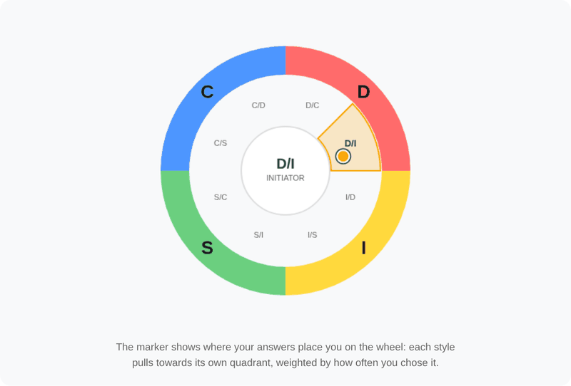
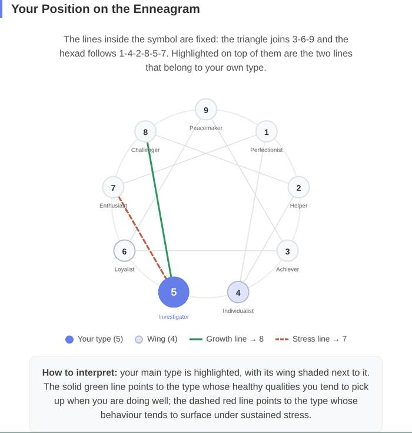
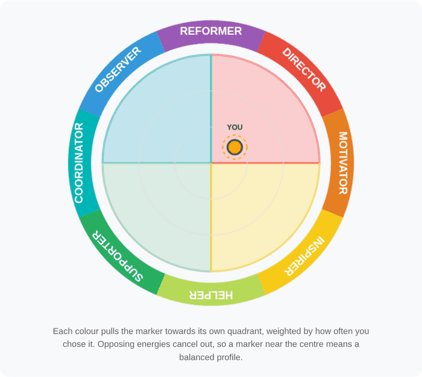
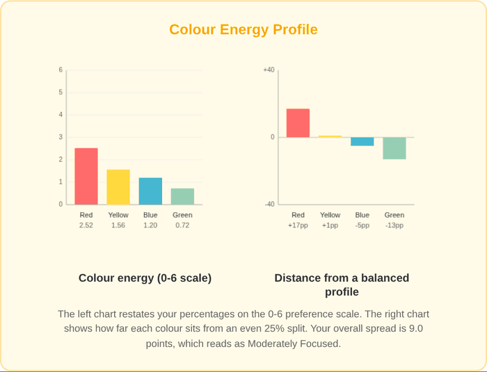
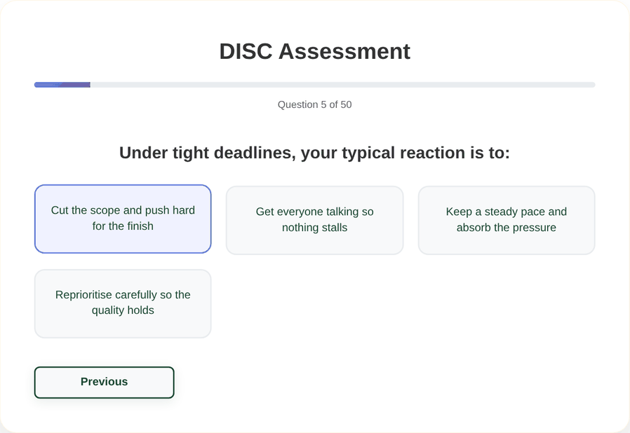
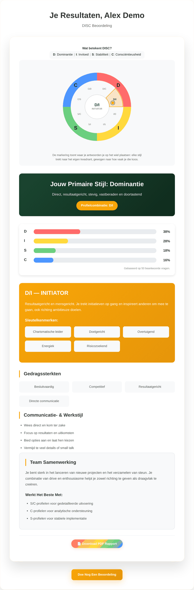

# Release notes

## Unreleased — Report accuracy audit

All three reports were audited end to end: how answers are stored, how they are turned into
scores, and whether the charts show what the numbers say. Several defects were found that
changed the result a user was shown. This release fixes them, moves scoring into a tested
module, and adds screenshots of each report below.

---

### DISC

The wheel now places each combination inside the correct quadrant, highlights the segment your
answers land in, and draws a marker derived from the actual score distribution.

**Fixed**

- **Eight of twelve profiles were missing.** `D/S`, `S/D`, `I/C` and `C/I` had no entry in the
  profile table and silently fell back to `D/I`. A steady, detail-driven respondent could be
  shown the headline "Your Primary Style: Steadiness" directly above a write-up describing a
  charismatic risk-taker. All twelve ordered pairs now have their own profile.
- **The wheel was drawn once, before the answers loaded.** The parent view reads answers from
  `localStorage` in its own `onMounted`, which runs *after* the child's. The canvas was painted
  from an empty result set, so the highlight sat on `D/I` for every user regardless of their
  scores. The wheel now redraws whenever the results change.
- **Half the wheel labels were in the wrong quadrant.** `I/D` sat in the D quadrant, `S/I` in
  the I quadrant, and so on. Each quadrant is now split between its two neighbours, so `D/I`
  sits next to `I/D`.
- **An unanswered report rendered `NaN%`** on every bar and still claimed a primary style.
  There is now an empty state.
- **Percentages did not always sum to 100** because each bar was rounded independently.
- **Ties were broken inconsistently**, so the headline style and the combination badge could
  disagree.
- **Scoring assumed option order.** Every question's options had to be listed in D, I, S, C
  order or the answer counted towards the wrong style. Each option now carries its style
  explicitly, in all five languages.

### Enneagram

**Fixed**

- **The scoring ignored the questions.** Types were assigned with
  `(answerIndex % 9) + 1` — the *agreement level* picked the type, not the statement being
  agreed with. Answering "Completely agree" to all fifty questions returned Type 7 at 100%;
  answering "Neutral" to all fifty returned Type 4. Types 8 and 9 were unreachable, because the
  agreement scale only has seven points. Every question is now tagged with the type it measures
  and scored on the 0–6 agreement scale.
- **Scores are normalised per type.** Types are covered by different numbers of questions
  (4 to 7), so a type's score is the agreement it collected as a share of the agreement it
  could have collected, before being expressed as a percentage.
- **The symbol was rotated 80° out of position**, putting Type 9 on the left instead of the top.
- **The interior lines connected the wrong types.** The label said "triangle (3-6-9) and hexagon
  (1-4-2-8-5-7)"; the code drew 2-5-8 and 9-3-1-7-4-6.
- **The lines were rotated independently of the numbers**, so for any dominant type other than 1
  they floated free of the circles they were supposed to join.
- Added the wing, and the growth (integration) and stress (disintegration) lines for the
  dominant type, with a legend.

### Typix Discovery (Insights)

**Fixed**

- **The wheel marker was 45° out.** Each colour was aimed at the *edge* of its quadrant rather
  than its centre, so a Red-dominant profile plotted on the Red/Yellow boundary.
- **The marker barely left the centre.** The vector sum was never normalised, so a 44/24/18/14
  profile landed at roughly a fifth of the radius. A single-colour profile now reaches the rim.
- **The headline colour and the profile position could contradict each other.** With Red and
  Blue tied, the headline read "Your Primary Colour: Blue" while the badge read "Analytical
  Driver", which is the Red-Blue label. Both now come from the same ranking.
- **The "Energy Dynamics" panel was not measuring anything.** The "less conscious persona" was
  produced by rotating the colour list by one position — Red's percentage was relabelled as
  Yellow, Yellow's as Blue, and so on — and the "preference flow" was the difference between
  that rotation and the original. The questionnaire captures a single conscious preference per
  question and has no second instrument behind it, so there was nothing there to plot. It is
  replaced by two panels drawn from the real scores.

- Percentages now sum to 100, and an unanswered report shows an empty state instead of a
  fabricated 25/25/25/25 profile.

### Across all three reports

- Scoring moved out of the components into `src/scoring/`, covered by unit tests (`npm test`).
  The tests assert the properties that were broken: percentages summing to 100, every type and
  every combination being reachable, ties resolving consistently, and no `NaN` for an
  unanswered assessment.
- Report views reload their answers when the route changes. Previously, navigating from
  `/report/disc` to `/report/enneagram` reused the DISC answers under the Enneagram heading.
- Language switching now updates question text. `useTranslations` returned a plain string
  captured at setup, so questions stayed in whichever language was active when the component
  mounted.
- Answers are stored as `{ questionIndex, answerIndex, value }` for all three assessments.
  Answers written by earlier versions are still read correctly.

### The DISC questionnaire

48 of the 50 DISC questions used to offer the same four generic options — "Direct and
results-focused", "Enthusiastic and people-oriented", "Steady and supportive", "Careful and
detail-oriented" — so only the question text changed while the answers stayed the same. A
respondent could read fifty different situations and pick from one unchanging list, which tells
them nothing about what they are choosing.

All 50 questions are rewritten with responses written for that specific situation, in all five
languages. A test asserts that no two questions in a language share an answer option.

### Report copy is now translated

Section headings already followed the selected language, but the profile descriptions, traits,
tips, motivations and fears did not — the report switched to Dutch and then explained your
profile in English. All of it now lives in `src/i18n/content/` and is written in all five
languages: 4 DISC styles and 12 combinations, 9 Enneagram types, 4 colour energies with their
12 profile positions, plus the chart captions and footnotes.

A test compares the shape of every locale against English, so a missing or empty string fails
the build rather than falling back silently.

The half-finished `disc_style_d_*` and `disc_combo_di_*` keys — which covered only the D style
and the D/I combination and were never read — are removed.

### Continuous integration

The repository had no CI: the only workflow deployed to GitHub Pages on a push to `main`, so
nothing ran on a pull request. `.github/workflows/ci.yml` now runs `npm test` and a production
build (which includes `vue-tsc`) on every pull request and every push to `main`.
